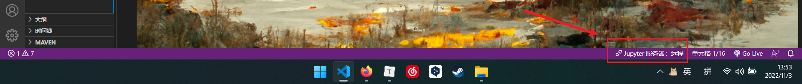
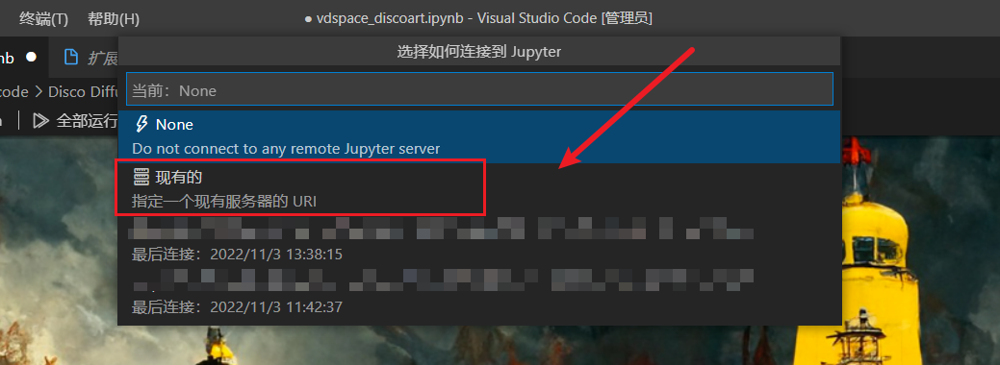
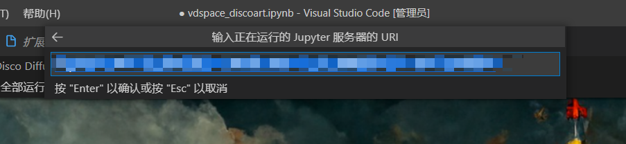
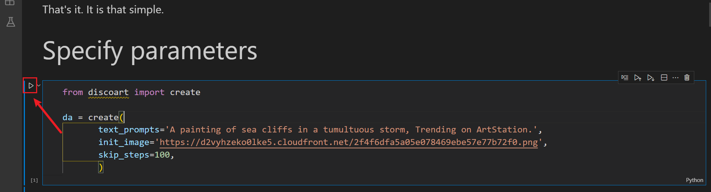
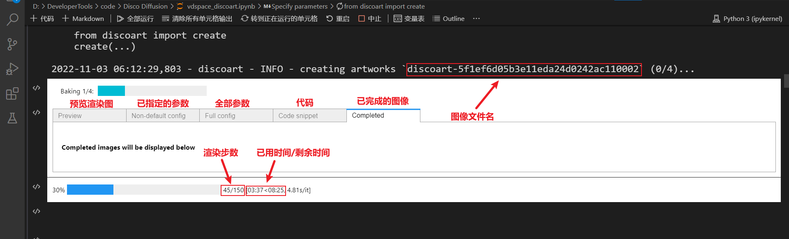
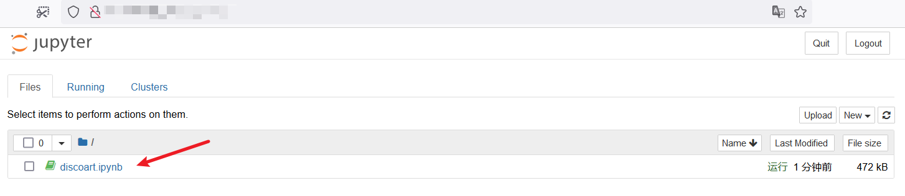
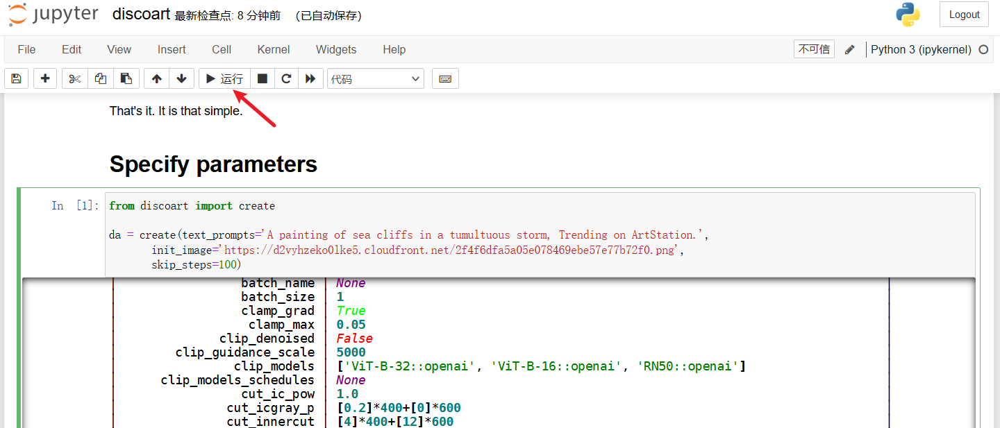

✨ **获取灵感**：加入**Disco Diffusion** 的 [Discord频道](https://discord.gg/BT8um4WGcC) 获取灵感并分享你的作品。

📒 **了解Discoart**：访问 **Discoart** 的 [GitHub主页](https://github.com/jina-ai/discoart) 了解更多相关知识。

💡 **更多参数提示**：在`docs/`目录下存放有一些文档资源。

🎨 **其他的AI创作工具**：[Midjourney](https://discord.gg/midjourney)，

🛠️ **图片修复**：使用 [Waifu2x-Extension-GUI](https://github.com/AaronFeng753/Waifu2x-Extension-GUI/releases/v3.96.01) 来增强图像画质。

# 部署

**关于将 Discoart 部署至服务器的更多细节请查看由 [@AydenLi](https://github.com/AydenLii) 编写的[文档](EnvironmentConfig.md)。** 

# 使用

将库拉取到本地

```sh
git clone https://github.com/liuxiyuan-2022/vdspace_discoart.git
```

你可以使用 [Jupyter notebook](##在 Jupyter NoteBook 上使用) 或者 [VS Code](##在 VS Code 上使用) 运行 Discoart 。

## 在 VS Code 上使用

> Visual Studio Code  是一个轻量级但功能强大的源代码编辑器，适用于 Windows、macOS 和 Linux。并为其他语言和运行时（如  C++、C#、Java、Python、PHP、Go、.NET）提供了丰富的扩展生态系统。

### 安装 VS Code

- 安装 [VS Code](https://code.visualstudio.com/) 的最新版本

### 安装 VS Code 扩展

1. 打开 VS Code
2. 按下 `Ctrl+Shift+x`  或在左侧边栏点击对应图标，打开扩展列表
3. 在扩展搜索框中输入「**Jupyter**」，然后在扩展预览界面点击 **Install** 安装
4. 点击 **Reload to Activate** 以重新启动 VS Code

### 连接 Jupyter 服务器  

1. 使用 VS Code 打开 `discoart.ipynb` 文件。

2. 在下方的状态栏中点击 **Jupyter 服务器：本地** ，来连接至远程 Jupyter 服务器。

   

3. 在上方弹出的选项框中，选择 **指定现有的服务器** 选项。并输入**正在运行服务器的 URL** 并按下 `Enter` 进行连接。

   

   

### 开始创作！

选中 **Specify parameters** 代码块并点击左侧 **开始运行** 按钮。



在下方的**单元格输出栏**中，可以预览当前图片的渲染进度。



## 在 Jupyter NoteBook 上使用

> Jupyter Notebook 的详细操作请自行查阅文档，这里不再赘述。

### 在浏览器中访问 **Docker** 生成的链接

> 注意：每次重启 Docker 服务后，**Token**值都会改变。



> 如果**笔记本列表中**没有 **discoart.ipynb** 文件，则需要自行上传

### 开始创作！

- 单击列表中的 **discoart.ipynb** 文件，会自动跳转至对应页面。

- 选中 **Specify parameters** 代码块并点击上方**运行**按钮。



> **边框绿色**代表选中状态

##关于参数设置的更多细节

**关于全部参数更深入的解释请查看[这里]()，在那里你将看到更多的例子。**

# 资源链接

- [Disco Diffusion Cheatsheet v0.3](https://docs.google.com/document/d/1l8s7uS2dGqjztYSjPpzlmXLjl5PM3IGkRWI3IiCuK7g/edit)
- [EZ Charts - Diffusion Parameter Studies ](https://docs.google.com/document/d/1ORymHm0Te18qKiHnhcdgGp-WSt8ZkLZvow3raiu2DVU/edit#)
- [Disco Diffusion **GitHub**](https://github.com/alembics/disco-diffusion)
- [Disco Diffusion **Colab**](https://colab.research.google.com/github/alembics/disco-diffusion/blob/main/Disco_Diffusion.ipynb#scrollTo=TitleTop)
- [ArtStation](https://www.artstation.com/?sort_by=trending)
- [Disco Diffusion 70+ Artist Studies](https://weirdwonderfulai.art/resources/disco-diffusion-70-plus-artist-studies/)
- [A Traveler’s Guide to the Latent Space](https://sweet-hall-e72.notion.site/A-Traveler-s-Guide-to-the-Latent-Space-85efba7e5e6a40e5bd3cae980f30235f#e122e748b86e4fc0ad6a7a50e46d6e10)
- [Disco Diffusion Illustrated Settings](https://coar.notion.site/Disco-Diffusion-Illustrated-Settings-cd4badf06e08440c99d8a93d4cd39f51)
- [Coar’s Disco Diffusion Guide](https://coar.notion.site/coar/Coar-s-Disco-Diffusion-Guide-3d86d652c15d4ca986325e808bde06aa#8a3c6e9e4b6847afa56106eacb6f1f79)