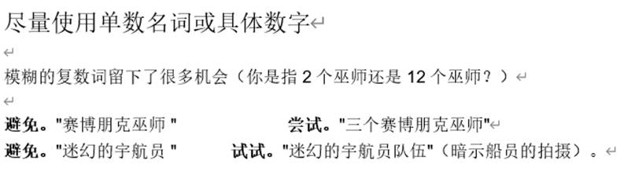

**A Guide to Writing Prompts for Text-to-image AI**

Please leave comments / ideas / suggestions / questions <3 

**Anything left unsaid may surprise you**

You can be as specific or as vague as you want, but anything you leave out will be randomized. Being vague is a great way to get variety, but you may not get what you’re looking for. 

Try to be clear about any context or details that are important to you.

 

 

Try visually well-defined objects (*something with a lot of photos on the internet)*

**Try:** Wizard, priest, angel, emperor, necromancer, rockstar, city, queen, zeus, house, temple, farm, car, landscape, mountain, river

 

Strong feelings or mystical-sounding themes also work great

**Try:** “a sense of awe” “the will to endure” “cognitive resonance” “the shores of infinity” “the birth of time” “a desire for knowledge” “the notion of self”

Try describing a *style*

**Examples:** “a cyberpunk wizard” “a surreal landscape” “a psychedelic astronaut” 

**Try:** cyberpunk, psychedelic, surreal, vaporwave, alien, solarpunk, modern, ancient, futuristic, retro, realistic, dreamlike, funk art, abstract, pop art, impressionism, minimalism

 

Try invoking unique artists to get a unique style

**Examples:** “Temple by James Gurney” “Father by MC Escher”

**Try:** Hiroshi Yoshida, Max Ernst, Paul Signac, Salvador Dali, James Gurney, M.C. Escher, Thomas Kinkade, Ivan Aivazovsky, Italo Calvino, Norman Rockwell, Albert Bierstadt, Giorgio de Chirico, Rene Magritte, Ross Tran, Marc Simonetti, John Harris, Hilma af Klint, George Inness, Pablo Picasso, William Blake, Wassily Kandinsky, Peter Mohrbacher, Greg Rutkowski, Paul Signac, Steven Belledin, Studio Ghibli

**Combine names for new styles:** “A temple by Greg Rutkowski and Ross Tran”

Try invoking a particular *medium*

If the style is unspecified, it will lean towards photorealism

**Examples:** “a watercolor painting of a landscape” “a child's drawing of a home”

**Try:** painting, drawing, sketch, pencil drawing, w, woodblock print, matte painting, child's drawing, charcoal drawing, a ink drawing, oil on canvas, graffiti, watercolor painting, fresco, stone tablet, cave painting

Speak in positives. Avoid negatives 

Language models often ignore negative words (“not” “but” “except” “without”).

**Avoid:** “a hat that’s not red” “        **Try:** “a blue hat”

**Avoid:** “a person but half robot”      **Try:** “half person half robot”

 

Specify what you want clearly

**Avoid:** “monkeys doing business”    **Try:** “three monkeys in business suits”

If you want a specific composition, say so!

**Examples:** “a portrait of a queen” “a ultrawide shot of a queen” 

[Disco Diffusion v5.1 [w/ Turbo\] - Colaboratory](https://colab.research.google.com/github/alembics/disco-diffusion/blob/main/Disco_Diffusion.ipynb)

**Try:** portrait, headshot, ultrawide shot, extreme closeup, macro shot, an expansive view of

 

Too many small details may overwhelm the system:

**Avoid:** “a monkey on roller skates juggling razor blades in a hurricane” 

**Try:** “a monkey that’s a hurricane of chaos”

Try taking two well defined concepts and combining them in ways no one has seen before

**Examples:** “cyberpunk shinto priest” “psychedelic astronaut crew” “river of dreams” “temple of stars” “queen of time” “necromancer capitalist”

Try to se singular nouns or specific numbers

Vague plural words leave a lot to chance (did you mean 2 wizards or 12 wizards?)

**Avoid:** “cyberpunk wizards”      **Try:** “three cyberpunk wizards”

**Avoid:** “psychedelic astronauts”  **Try:** “psychedelic astronaut crew” (implies a crew shot)

Avoid concepts which involve significant extrapolation 

**Avoid:** “an optimistic vision of an augmented reality future” 

**Try:** “a solarpunk city filled with holograms”

**Avoid:** “Clothes humans will wear 12,000 years into the future”

**Try: “**wildly futuristic clothing with glowing and colorful decoration”

 

**Fun Ad Libs**

The tree of __________ and __________ 

The temple of __________ and __________ 

The gateway to __________ and _________

The angel of _____ and _______

The emperor/empress of __________

 

__________ in the style of a 70s science fiction novel cover

__________ in the style of a metal album cover

__________ in the style of cyberpunk noir art deco 

__________ in the style of glitch art

 

biblical fantasy illustration of ______

a ancient chinese painting of ______

a surreal and organic stone monument to _______

 

 

**Fun word lists**

**Could** 

**Punk style list:** cyberpunk, nanopunk, biopunk, cyber noir, steampunk, clockpunk, dieselpunk, decopunk, coalpunk, atompunk, steelpunk, islandpunk, oceanpunk, rococopunk, stonepunk, mythpunk, raypunk, nowpunk, cyberprep, postcyberpunk, solarpunk, lunarpunk, elfpunk, atompunk, neonpunk

**Tarot Cards (Major Arcana):** The Fool, The Magician, The High Priestess, The Empress, The Emperor, The Hierophant, The Lovers, The Chariot, Strength, The Hermit, Wheel of Fortune, Justice, The Hanged Man, Death, Temperance, The Devil, The Tower, The Star, The Moon, The Sun, Judgment, The World

